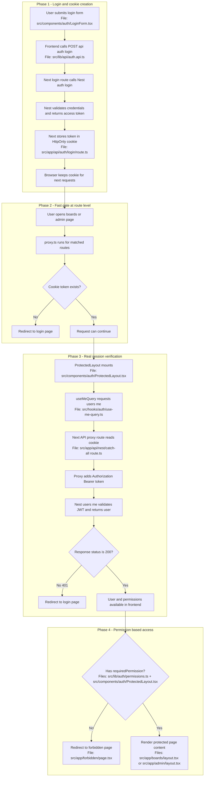

# Auth Session Flow

## Notes

- `proxy.ts` quick filter file: `src/proxy.ts`.
- `ProtectedLayout` real auth and permission gate file: `src/components/auth/ProtectedLayout.tsx`.
- If JWT is invalid or expired, Nest returns 401 and frontend redirects to login.
- Even with frontend guards, backend remains the final source of truth for authorization.
