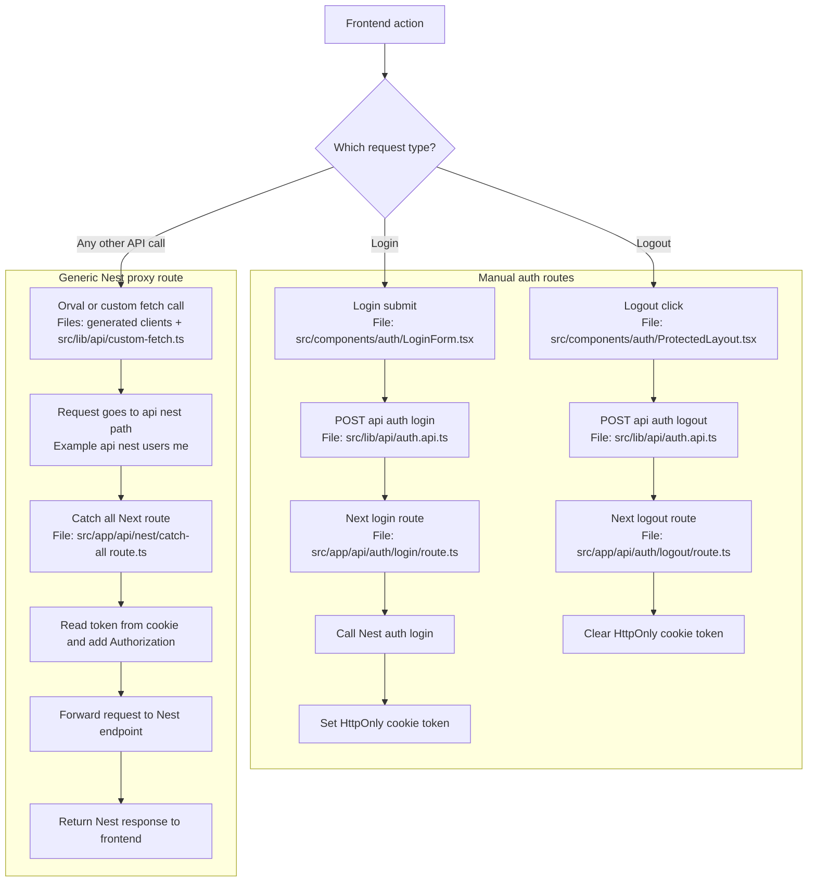

# Request Routing Split

## Notes

- Login and logout are handled manually with dedicated Next routes.
- All other backend calls are funneled through the generic `api/nest` catch-all route.
- The catch-all route centralizes token injection into the `Authorization` header.

